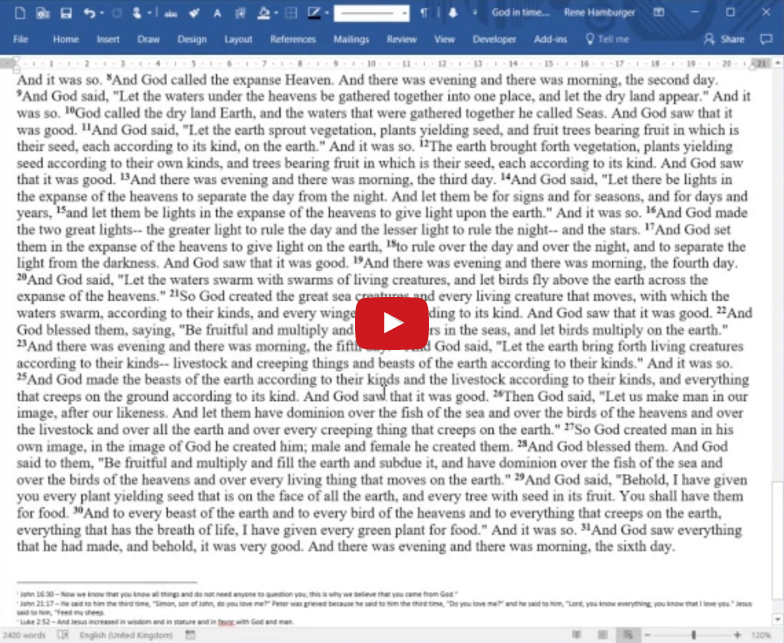

# Blinx

Blinx is a Microsoft Word add-in that converts Bible references within Word into Bible links: Have a look at [this example Word document](docs/Example article with Bible links.doc) or even [this pdf](docs/Example article with Bible links.pdf). These Blinks contain the passage (stored as an endnote in the Word document), which becomes visible as a tooltip when the mouse pointer is hovering over it. They are also hyperlinks to an online Bible ("ctrl-left click" on the link). On computers where the Blinx add-on and [BibleWorks](http://www.bibleworks.com) are installed, a "right-click" on the link opens it directly in BibleWorks.

The following screencast demonstrates the main features of the add-in:

### Requirements[**1**](#_ftn1)
- Windows (Windows XP+)
- Microsoft Word (2003+)
- Internet Explorer 8+ with an active internet connection or alternatively BibleWorks (7+)

### Installation
- Close Microsoft Word and Outlook.
- Copy [Blinx.dot](https://raw.githubusercontent.com/renehamburger/blinx/master/Blinx.dot) into your Microsoft Word start-up folder:[2](#_ftn2)
  * Possibly: C:\Program Files\Microsoft Office\OfficeXX\Startup
  * or: C:\Documents and Settings\YOUR_USER_NAME\Application Data\Microsoft\Word\Startup
- The add-in will now be loaded automatically when Word is started.

### Usage
- **Important: The execution of Blinx can always be interrupted by pressing "Ctrl-Break"**
- The add-in contains 5 functions that can either be accessed through the Blinx toolbar (in the Add-Ins tab in Word 2007+) or through keyboard shortcuts:
  *  **Create Blink (Alt-B)**: Converts all Bible references within the selection or the closest one to the left of the cursor into a pure Bible link without passage.
  *  **Create Blink & tooltip (Alt-B)**: Converts all Bible references within the selection or the closest one to the left of the cursor into a Bible link with the passage as tooltip.
  *  **Create Blink & insert text (Alt-Shift-B)**: Converts all Bible references within the selection or the closest one to the left of the cursor into a Bible link and inserts the passage into the text.
  *  **Unlink Blinks and hyperlinks (Alt-U)**: Converts all Blinks or hyperlinks within the selection or the closest one to the left of the cursor into normal text.
  *  **Open Blinx options dialog (Ctrl-Alt-Shift-B)**:
    - Language of Bible references: English, German
    - Bible translation: ESV, NIV, NASB, KJV, ...
    - Online Bible for hyperlinks
    - Length of passage tooltips
    - Reset Blinx (which can solve a few issues)
    - Abbreviations for all Bible books, which can be edited with a double-click.[3](#_ftn3)

### Copyright
- The current version of Blinx obtains Bible passages either from BibleWorks (if installed) or otherwise from [www.biblegateway.com](http://www.biblegateway.com/) for this initial proof of concept.
- All modern Bible versions are copyrighted. See [www.biblegateway.com/version](http://www.biblegateway.com/version) for copyright regulations of various Bible versions. For extensive quotes in a publication (usually if over 200 verses or more than 10% of a biblical book), a permission in writing needs to be obtained from the appropriate copyright owner.
- Biblegateway.com and BibleWorks do not _appear_ to require any additional copyright notice for quotations acquired through their website/software.

### Known issues
- The reference links contain a special Unicode space between the book name and the chapter number. If it is not displayed as a space, choose an appropriate font (e.g. Times New Roman, Arial, Tahoma, Calibri ...)
- A bug in BibleWorks means that every creation of a Blink will reset the display versions to what they were at the start-up of BibleWorks. If you restart (or just close) BibleWorks, the current display versions will be the new default versions for every following Blink creation.
- Running Blinx might reset some formatting options of a previous search/replace in Word.
- The initial start-up of BibleWorks or Internet Explorer (hidden) can take up to 20 sec.
- BibleGateway limits passage lookups to about 5500 words.
- Further issues are mentioned in [Issues.doc](docs/Issues.doc).

Let me know about bugs or improvements that would be useful at https://github.com/renehamburger/blinx/issues.

### Roadmap
- For the present Word add-on, there are 2 remaining objectives:
  - Move to a public API like https://bibles.org/pages/api to obtain the online passage.
- A complete redesign of the core functionality of the plugin into a cross-platform library that could also be made available through a public API would be desirable. See [blinx-core](https://github.com/renehamburger/blinx-core) for an initial proof of concept.
- A plugin system could be used to add any data source for retrieving Scripture passages (e.g., BibleWorks, Logos, theWord, free online Bibles & Bible APIs).
- Custom add-ons for Word, Open Office Writer, Adobe Acrobat, Google Docs could then be added to creating Bible links on the fly.
- (The [example pdf](docs/Example article with Bible links.pdf) linked above was generated with an alpha version of such an Adobe Acrobat plugin.)
- I'm looking for other developers to join the project before embarking on it.

* * *

[1]
The add-in should also work with some earlier versions of these applications.

[2]
The location of the start-up folder can also be checked and changed in Word:
- Word 2003: "Tools | Options | File Locations | Startup"
- Word 2007: "Office Button | Word Options | Advanced tab | File Locations"
- Word 2010: "File | Options | Advanced tab | File Locations"

[3]
Blinx will only recognize the abbreviations in this list (allowing for variations like Roman numerals instead of 1/2/3 before book names, additional full stops, additional or fewer spaces…) Chapter-verse separator can be either ":" or ".".  The book name must be separated from the rest of the reference by at least 1 space or 1 full stop (e.g. "Jn 3:16" or "Jn.3:16").
